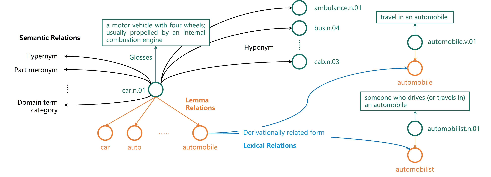

# WordNet
## Motivation
[WordNet](https://wordnet.princeton.edu/) is an English word lexical knowledge base proposed by a research team from 
Princeton University. It explicitly depicts lexical relations between tens of thousands of word 
(as well as some phrases). We believe WordNet has great potential in data-driven natural language processing research. 
However, we found the original knowledge base 
released by the WordNet research team is hard to parse. 

## WordNet Introduction

The above figure generally describes the data structure of WordNet and some concept need to be explained.

- **Lemma** (orange circle): Each lemma indicates an English word (or phrase in some occasions)
- **Synset** (green circle): Synsets are the groupings of synonymous words that express the same concept. Typically, each synset
  contains several lemmas, indicating the meaning of these lemmas are similar. Nouns (N), verbs (v), adjectives (adj), and adverbs (adv)
  are grouped into sets of synsets. For example, the ""
- **Glosses** (green rectangle): Each synset is affiliated a glosses, which is a sentence that describes the meaning of the synset.
  Some synsets also has extra example sentences to show how specific words can be used in sentences. However, we did not draw 
  example sentences in the figure as they are only available in a fraction of synsets.
- **Relations**
    - **Semantic Relations** (black arrow): Describes relationship between synsets. 
    - **Lexical Relations** (blue arrow)
    - **Lemma Relations** (orange arrow)

### Statistics
| Type  | Number | Type | Number| Type | Number
| :-----| :----  | :---- |:----|:---|:---|
|**Lexical Relations**||||
|Antonym| 7,979 |Derivationally Related Form|74,705|Pertainym|8,022|
|**Semantic Relations**|
|Hypernym|89,089|Hyponym|89,089|Instance Hypernym|8,577|
|Instance Hyponym|8,577|Member Holonym|12,293|Substance Holonym|797|
|Part Holonym|9,097|Member Memronym|12,293|Substance Memronym|797|
|Part Memronym|9,097|Topic Domain|6,654|In Topic Domain|6,654|
|Region Domain|1,360|In Region Domain|1,360|Usage Domain|1,376|
|In Usage Domain|1,376|Attribute|1,278|Entailment|408|
|Cause|220|Also See|3,272|Verb Group|1,750|
|Similar TOS|21,386|
|**Lemma Relations**|
|Lemma||206,941|Is Lemma|206,941|

## Parsed WordNet